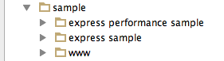
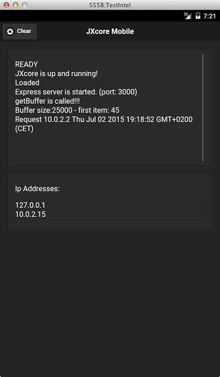
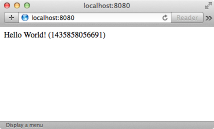
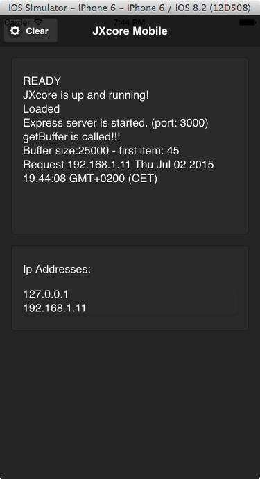

## How to Run Node with Express on Mobile Devices

We released a [JXcore](http://jxcore.com) plugin for [Apache Cordova](http://cordova.apache.org/) platform a few months ago and published an article entitled [“Develop an iOS Application with Node.js and Cordova”](http://modernweb.com/2015/03/19/develop-an-ios-application-with-node-js-and-cordova/). Today I’d like to demonstrate another interesting subject – how to run Node [express](https://www.npmjs.com/package/express) application with cordova on a mobile device.

At the time of writing this text the [jxcore-cordova](https://github.com/jxcore/jxcore-cordova) project on github already has two samples prepared for running express module:



The project also contains the [install_and_run](https://github.com/jxcore/jxcore-cordova/blob/master/install_and_run.sh) script (documented [here](https://github.com/jxcore/jxcore-cordova/blob/master/install_and_run.md)), which simplifies the tasks related to creating a cordova application and running any of the samples mentioned above. I'm just going to use this script in this article.

### Express on Android

The script mentioned above assumes, that Apache Cordova is already installed together with Android SDK. If you don’t have Cordova installed yet, please refer to [command-line interface](http://cordova.apache.org/docs/en/4.0.0/guide_cli_index.md.html#The%20Command-Line%20Interface) documentation.

Let’s plug our android device into a USB socket (with USB Debugging option enabled), unless you want to run the application on Android Emulator.

We’ll start with downloading the [script](https://github.com/jxcore/jxcore-cordova/blob/master/install_and_run.sh) and saving it into an empty folder. Now we can run it with a sample folder name as an argument – let’s take for example “express sample”:

```bash
$ ./install_and_run.sh "express sample"
````

Few minutes later you should be able to see the following screen: 



The application displays some IP addresses, which the device is currently using. Also it informs us, at which port the express server is running (3000 in our case). Let’s use that information and type the following URL into the PC’s browser:

```
http://10.0.2.15:3000
```



Now we can see, that the browser was able to successfully connect with our Express server running on the device and receive the proper answer for the request!

**A note for emulator users**: As you might have noticed on the screen above, I did not use the IP and port mentioned before, but http://localhost:8080 instead. This is because I was running the sample on Android AVD (Android Virtual Device), and the IP is not reachable outside the emulator’s internal router (see: [Emulator Networking](http://developer.android.com/tools/devices/emulator.html#emulatornetworking). Thus my solution was able to establish a simple port redirection:

```bash
telnet localhost 5558
redir add tcp:8080:3000
```

which redirects all http requests from my localhost:8080 into emulator’s 3000 port. The 5558 number is the port on which my AVD was running (visible at AVD’s title bar).

### Express on iOS

We can also run the same sample on iOS devices. The same *install_and_run.sh* script can handle that, but the iOS support is currently commented out, if you’ll look at the end of the script.

```bash
# or run on ios
$ cordova platforms add ios
$ cordova run ios
```



This time accessing the Express server from PC’s browser is more straightforward: http://192.168.1.11:3000 . 

### Looking at the code

As we may see at *app.js* located under *www/jxcore* folder of the *express sample*, the Express server is implemented exactly the same way, as it would be for regular a Node.js application:

```js
var express = require('express');
var app = express();

app.get('/', function (req, res) {
  res.send('Hello World! (' + Date.now() + ")");
});

var server = app.listen(3000, function () {
  clog("Express server is started. (port: 3000)");
});
```

### Express server running on another thread

Once we’re done with the previous sample we can see how the other one is working:

```bash
$ ./install_and_run.sh "express performance sample"
```

Basically it performs the same thing. There is one major difference though: it runs the express server in a separate thread unblocking the main one. This is amazingly easy with JXcore as it offers multitasking from the very first day it was released – much before it arrived into mobile platforms. 

Below is how the code looks like:  

```js
jxcore.tasks.addTask(function() {
  var clog = require('./utilities').log;
  var express = require('express');
  var app = express();

  app.get('/', function (req, res) {
    res.send('Hello World! (' + Date.now() + ")");
  });

  var server = app.listen(3000, function () {
    clog("Express server is started. (port: 3000)");
  });
});
```

Please note, that the code looks pretty much similar to the previous one. It is just wrapped into `jxcore.tasks.addTask()` invocation which handles all the logic related with running the block under separate instance.

### Conclusion

The Express web framework is one of the most popular and important modules in the Node.JS ecosystem. Now with JXcore it is possible to make it run on mobile devices, which can be found everywhere nowadays.
 
Furthermore, as JXcore brings a range of several new features (e.g. multithreading/multitasking or packaging, to name just few) – those also can be used in mobile world (the second sample above shows that).
 
JXcore is an open source [project](https://github.com/jxcore/jxcore) primarily based on Node.JS, but with a number of new features. One of the most important in terms of reaching mobile platforms is a multi-engine architecture allowing JXcore to compile against SpiderMonkey JavaScript engine.
